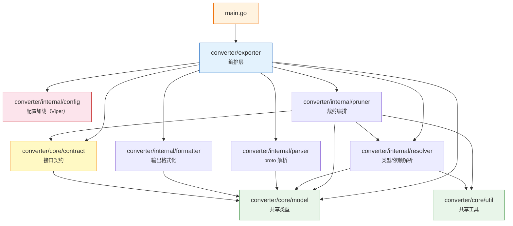

# 模块依赖图

## 包级依赖关系

> `config` 包不依赖 `core/model`（它内联了自己的 `SeedItem` 类型以避免循环依赖），仅依赖标准库和 Viper。

## 依赖矩阵

| 包 ↓ 依赖 → | core/model | core/util | core/contract | internal/config | internal/parser | internal/resolver | internal/pruner | internal/formatter |
|:---|:---:|:---:|:---:|:---:|:---:|:---:|:---:|:---:|
| **main** | | | | | | | | |
| **exporter** | ✓ | | ✓ | ✓ | ✓ | ✓ | ✓ | ✓ |
| **core/contract** | ✓ | | | | | | | |
| **core/util** | | | | | | | | |
| **internal/config** | | | | | | | | |
| **internal/parser** | ✓ | | | | | | | |
| **internal/resolver** | ✓ | ✓ | | | | | | |
| **internal/pruner** | ✓ | ✓ | ✓ | | | ✓ | | |
| **internal/formatter** | ✓ | | | | | | | |

## 设计要点

- **core/model** 是最底层的叶子包，不依赖任何其他内部包，所有共享类型都定义在这里
- **core/util** 仅依赖标准库，提供跨包共享的工具函数（如 `BaseName`），消除了 `resolver` 和 `pruner` 之间的重复代码
- **core/contract** 仅依赖 `core/model` 和标准库，集中定义所有核心接口（`Parser`、`TypeResolver`、`DepResolverIface`、`Formatter`、`DefPruner`），消除了 `pruner` 包中的重复接口定义
- **internal/config** 是独立的，不依赖 `core/model` 也不依赖其他子包（通过内联 `SeedItem` 类型避免循环依赖），使用 Viper 加载配置
- **internal/pruner → internal/resolver** 是功能层内部唯一的直接依赖，用于访问 `WellKnownTypes` 常量表
- **internal/pruner → core/contract** 使用集中定义的接口，不再本地重复定义
- **exporter** 是唯一的组装点，汇聚所有子包
- **main** 只依赖 `exporter` 编排层
- **internal/** 目录利用 Go 的 `internal` 可见性限制，确保功能层的包不会被 `converter/` 外部直接导入
