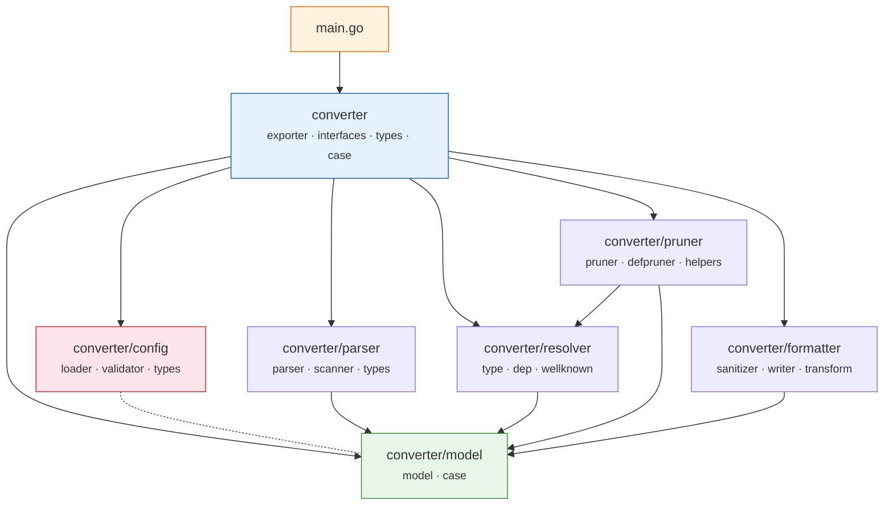

# 模块依赖图

## 包级依赖关系

> 虚线 `config -.- model` 表示 config 包**不**依赖 model（它内联了自己的 `SeedItem` 类型和 `normalizeSeedList` 函数以避免循环依赖）。

## 依赖矩阵

| 包 ↓ 依赖 → | model | config | parser | resolver | pruner | formatter |
|:---|:---:|:---:|:---:|:---:|:---:|:---:|
| **main** | | | | | | |
| **converter** | ✓ | ✓ | ✓ | ✓ | ✓ | ✓ |
| **config** | | | | | | |
| **parser** | ✓ | | | | | |
| **resolver** | ✓ | | | | | |
| **pruner** | ✓ | | | ✓ | | |
| **formatter** | ✓ | | | | | |

## 设计要点

- **model** 是唯一的叶子包，不依赖任何其他内部包，所有共享类型都定义在这里
- **config** 是独立的，不依赖 model 也不依赖其他子包（通过内联类型避免循环依赖）
- **pruner → resolver** 是子包之间唯一的直接依赖，用于访问 `WellKnownTypes` 常量表
- **converter** 是唯一的组装点，汇聚所有子包
- **main** 只依赖 converter 顶层包
